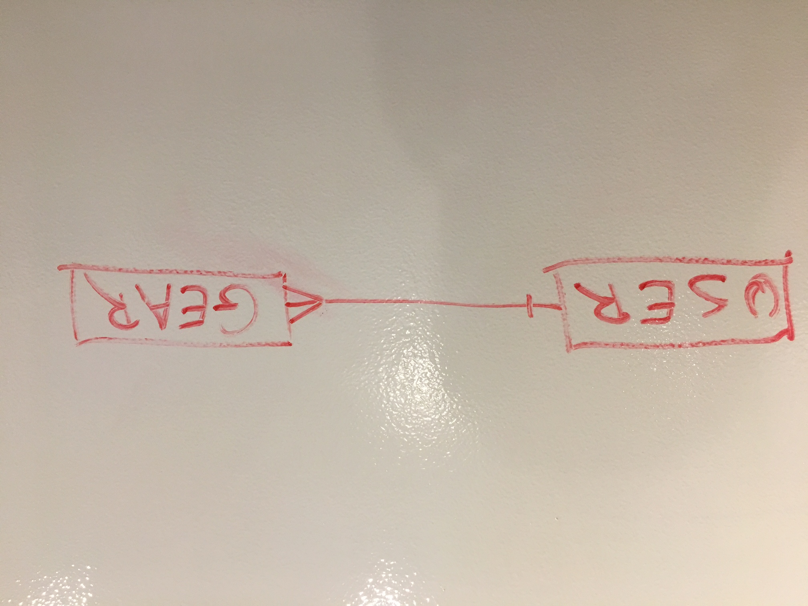

## About

This is the back-end repo of a SPA that lets users have a CRUDable database of
their gear.

## Dependencies

Bundle install

## Technologies used

- Mac Air '10, Chrome, Atom
- Front-end: Javascript, SCSS, Handlebars, AJAX, JQuery
- Back-end: Ruby, Rails, PostgreSQL, Heroku

## ERD



## Links

- Front-end repo: https://github.com/doremaxime/gear-frontend
- Heroku: https://capstone-project-gear.herokuapp.com
- Website: https://doremaxime.github.io/gear-frontend/

## Authorization

### User

 Verb  |      URI Pattern       | Controller#Action
:----: | :--------------------: | :---------------:
 POST  |       `/sign-up`       |  `users#signup`
 POST  |       `/sign-in`       |  `users#signin`
PATCH  | `/change-password/:id` | `users#changepw`
DELETE |    `/sign-out/:id`     |  `users#signout`

#### POST / sign-up
```sh
EMAIL="m" PASSWORD="m" PASSWORD_CONFIRMATION="m" sh scripts/sign-up.sh
```
```sh
API="${API_ORIGIN:-http://localhost:4741}"
URL_PATH="/sign-up"
curl "${API}${URL_PATH}" \
  --include \
  --request POST \
  --header "Content-Type: application/json" \
  --data '{
    "credentials": {
      "email": "'"${EMAIL}"'",
      "password": "'"${PASSWORD}"'",
      "password_confirmation": "'"${PASSWORD}"'"
    }
  }'
```
```md
HTTP/1.1 201 Created
Content-Type: application/json; charset=utf-8

{"user":{"id":1,"email":"m"}}
```

#### POST / sign-in
```sh
EMAIL="m" PASSWORD="m" PASSWORD_CONFIRMATION="m" sh scripts/sign-in.sh
```
```sh
API="${API_ORIGIN:-http://localhost:4741}"
URL_PATH="/sign-in"
curl "${API}${URL_PATH}" \
  --include \
  --request POST \
  --header "Content-Type: application/json" \
  --data '{
    "credentials": {
      "email": "'"${EMAIL}"'",
      "password": "'"${PASSWORD}"'",
      "password_confirmation": "'"${PASSWORD}"'"
    }
  }'
```
```md
HTTP/1.1 200 OK
Content-Type: application/json; charset=utf-8

{"user":{"id":1,"email":"m","token":"BAhJIiVjYjE3OTEyNmU2MmRiZWJiZGMxYzVjYjRmM2Q2YTA1ZAY6BkVG--33bf2e33670b0c1e457bdd3fd14d475119486e48"}}
```

#### PATCH / change-password
```sh
ID=1 TOKEN="BAhJIiVjYjE3OTEyNmU2MmRiZWJiZGMxYzVjYjRmM2Q2YTA1ZAY6BkVG--33bf2e33670b0c1e457bdd3fd14d475119486e48" OLDPW="m" NEWPW="o" sh scripts/change-password.sh
```
```sh
API="${API_ORIGIN:-http://localhost:4741}"
URL_PATH="/change-password"
curl "${API}${URL_PATH}/${ID}" \
  --include \
  --request PATCH \
  --header "Authorization: Token token=${TOKEN}" \
  --header "Content-Type: application/json" \
  --data '{
    "passwords": {
      "old": "'"${OLDPW}"'",
      "new": "'"${NEWPW}"'"
    }
  }'
```
```md
HTTP/1.1 204 No Content
```

#### DELETE / sign-out
```sh
ID=1 TOKEN="BAhJIiVjYjE3OTEyNmU2MmRiZWJiZGMxYzVjYjRmM2Q2YTA1ZAY6BkVG--33bf2e33670b0c1e457bdd3fd14d475119486e48" sh scripts/sign-out.sh
```
```sh
API="${API_ORIGIN:-http://localhost:4741}"
URL_PATH="/sign-out"
curl "${API}${URL_PATH}/${ID}" \
  --include \
  --request DELETE \
  --header "Content-Type: application/json" \
  --header "Authorization: Token token=$TOKEN"
```
```md
HTTP/1.1 204 No Content
```

### My_gear

Verb  |  URI Pattern   | Controller#Action
:----: | :------------: | :---------------:
POST  |   `/my_gears`   |  `my_gear#create`
GET   |   `/my_gears`   |  `my_gears#index`
GET   | `/my_gears/:id` |  `my_gears#show`
PATCH  | `/my_gears/:id` | `my_gears#update`
DELETE | `/my_gears/:id` | `my_gears#destroy`

#### POST / create
```sh
TOKEN="BAhJIiU3NTY5NDNiZTE5YzQ4NzdkM2E4Y2ZlYzA5NjI0OGY5YQY6BkVG--c537229f3e5ec10043b000ed934f0221acc17d76" NAME="rope" QUANTITY=2 sh scripts/my_gears/create.sh
```
```sh
API="${API_ORIGIN:-http://localhost:4741}"
URL_PATH="/my_gears"
curl "${API}${URL_PATH}" \
  --include \
  --request POST \
  --header "Content-Type: application/json" \
  --data '{
    "my_gear": {
      "name": "'"${NAME}"'",
      "quantity": "'"${QUANTITY}"'"
      }
    }' \
  --header "Authorization: Token token=$TOKEN"
```
```md
HTTP/1.1 201 Created
Content-Type: application/json; charset=utf-8

{"my_gear":{"id":1,"name":"rope","quantity":2}}
```

#### GET / index
```sh
TOKEN="BAhJIiU3NTY5NDNiZTE5YzQ4NzdkM2E4Y2ZlYzA5NjI0OGY5YQY6BkVG--c537229f3e5ec10043b000ed934f0221acc17d76" sh scripts/my_gears/index.sh
```
```sh
API="${API_ORIGIN:-http://localhost:4741}"
URL_PATH="/my_gears"
curl "${API}${URL_PATH}" \
  --include \
  --request GET \
  --header "Authorization: Token token=$TOKEN"
echo
```
```md
HTTP/1.1 200 OK
Content-Type: application/json; charset=utf-8

{"my_gears":[{"id":1,"name":"rope","quantity":2},{"id":2,"name":"cams","quantity":10}]}
```

#### GET / show
```sh
ID=2 TOKEN="BAhJIiU3NTY5NDNiZTE5YzQ4NzdkM2E4Y2ZlYzA5NjI0OGY5YQY6BkVG--c537229f3e5ec10043b000ed934f0221acc17d76" sh scripts/my_gears/show.sh
```
```sh
API="${API_ORIGIN:-http://localhost:4741}"
URL_PATH="/my_gears/${ID}"
curl "${API}${URL_PATH}" \
  --include \
  --request GET \
  --header "Authorization: Token token=$TOKEN"
```
```md
HTTP/1.1 200 OK
Content-Type: application/json; charset=utf-8

{"my_gear":{"id":2,"name":"cams","quantity":3}}
```

#### PATCH / update
```sh
ID=2 TOKEN="BAhJIiU3NTY5NDNiZTE5YzQ4NzdkM2E4Y2ZlYzA5NjI0OGY5YQY6BkVG--c537229f3e5ec10043b000ed934f0221acc17d76" NAME="cams" QUANTITY=3 sh scripts/my_gears/update.sh
```
```sh
API="${API_ORIGIN:-http://localhost:4741}"
URL_PATH="/my_gears/${ID}"
curl "${API}${URL_PATH}" \
  --include \
  --request PATCH \
  --header "Content-Type: application/json" \
  --data '{
    "my_gear": {
      "name": "'"${NAME}"'",
      "quantity": "'"${QUANTITY}"'"
      }
    }' \
  --header "Authorization: Token token=$TOKEN"
```
```md
HTTP/1.1 200 OK
Content-Type: application/json; charset=utf-8

{"my_gear":{"id":2,"name":"cams","quantity":3}}
```

#### DELETE / destroy
```sh
ID=2 TOKEN="BAhJIiU3NTY5NDNiZTE5YzQ4NzdkM2E4Y2ZlYzA5NjI0OGY5YQY6BkVG--c537229f3e5ec10043b000ed934f0221acc17d76" sh scripts/my_gears/destroy.sh
```
```sh
API="${API_ORIGIN:-http://localhost:4741}"
URL_PATH="/my_gears/${ID}"
curl "${API}${URL_PATH}" \
  --include \
  --request DELETE \
  --header "Authorization: Token token=$TOKEN"
```
```md
HTTP/1.1 204 No Content
```
